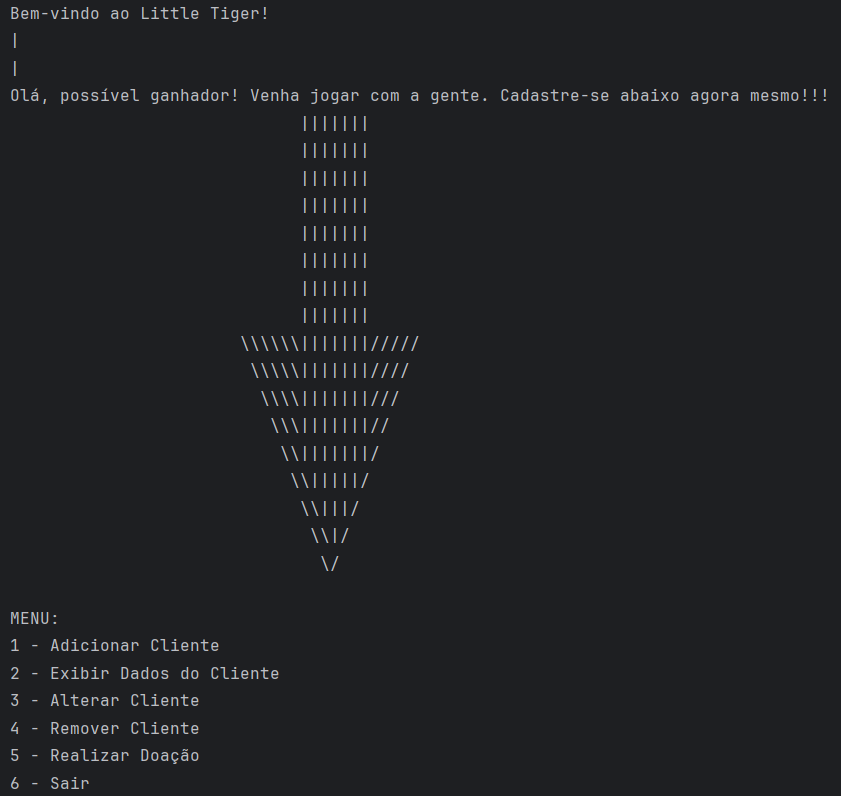
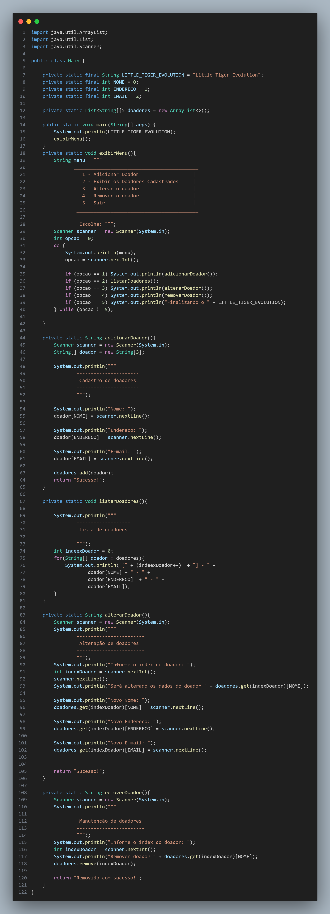

# 🧩 Atividade 06 – Sistema de Cadastro e Doações

> Mini sistema simulado em Java para cadastro de clientes, realização de doações, exibição e remoção de dados.

---

## 🎯 Objetivo

O objetivo desta atividade foi aplicar estruturas de controle como `switch`, `do-while`, e organizar métodos que simulam um pequeno sistema CRUD no terminal, com fluxo de decisão e entrada do usuário via `Scanner`.

---

## 🧠 Funcionalidades implementadas

- Cadastro de cliente com nome e idade
- Validação de idade mínima (18 anos)
- Exibição dos dados do cliente
- Alteração e remoção de cliente
- Registro e soma de doações
- Menu iterativo com controle via `switch` e `do-while`

---

## 💻 Menu do sistema



---

## 🔎 Estrutura de código

O código está dividido em métodos estáticos com responsabilidades claras.  
Exemplo:

```java
private static void adicionarCliente() {
    Scanner scanner = new Scanner(System.in);
    System.out.println("Informe seu nome: ");
    nome = scanner.nextLine();
    System.out.println("Informe sua idade: ");
    idade = scanner.nextInt();
    validarIdade();
}
```



---

## 📂 Estrutura de pasta

```
atividade-06-sistema-clientes-doacoes/
└── Main.java
```

---

## 🚀 O que aprendi

- A importância de organizar o código em métodos claros e independentes
- Controle de fluxo com `switch` e `do-while`
- Uso de variáveis estáticas e constantes
- Como validar dados e simular entradas com `Scanner`

---

## 🔧 Melhorias futuras

- Implementar `ArrayList` para permitir múltiplos clientes
- Separar a lógica em classes (após aprender POO)
- Criar interface visual usando `Swing` ou `JavaFX`

---

## 🔗 Voltar para o [README principal](README.md)
