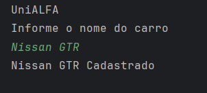
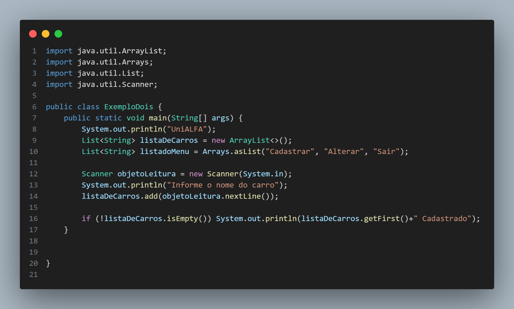

# 🧩 Atividade 08 – Cadastro com ArrayList e Menu

> Atividade prática que simula um menu interativo para cadastrar carros usando `ArrayList` e `List`.

---

## 🎯 Objetivo

Explorar coleções dinâmicas com `ArrayList` e criar um menu simples para operações básicas de cadastro e exibição.

---

## 🧠 Funcionalidades implementadas

- Cadastro de carros via entrada do usuário
- Menu textual com opções fixas (`Cadastrar`, `Alterar`, `Sair`)
- Impressão da primeira entrada cadastrada (demonstração)

---

## 💻 Menu do sistema



---

## 🔎 Estrutura de código

```java
List<String> listaDeCarros = new ArrayList<>();
List<String> menu = Arrays.asList("Cadastrar", "Alterar", "Sair");

Scanner leitura = new Scanner(System.in);
System.out.println("Informe o nome do carro:");
listaDeCarros.add(leitura.nextLine());
```



---

## 📂 Estrutura de pasta

```
atividade-08-arraylist-menu/
└── ExemploDois.java
```

---

## 🚀 O que aprendi

- Utilizar listas dinâmicas (`ArrayList`)
- Aplicar `Arrays.asList()` para menus
- Ler e armazenar dados em memória de forma simples

---

## 🔧 Melhorias futuras

- Adicionar laço para repetição do menu
- Implementar alterações reais e remoção
- Criar um extrato completo de todos os itens

---

## 🔗 Voltar para o [README principal](README.md)
