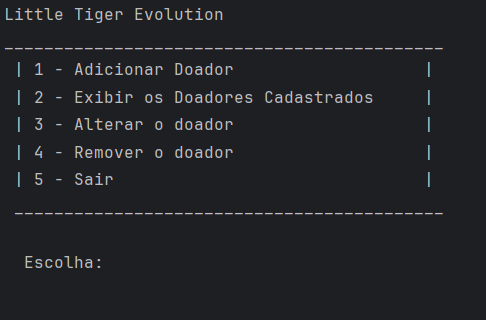
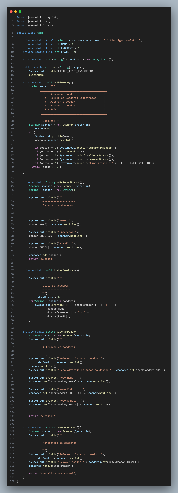

# 🧩 Atividade 09 – Sistema de Doadores (Little Tiger Evolution)

> Sistema que permite cadastrar, alterar, remover e listar doadores usando `ArrayList<String[]>` com estrutura de índices fixos.

---

## 🎯 Objetivo

Praticar organização de dados com arrays dentro de listas (`String[]` + `ArrayList`) e operações CRUD com controle de índices.

---

## 🧠 Funcionalidades implementadas

- Cadastro com nome, endereço e e-mail
- Listagem numerada de todos os doadores
- Alteração e remoção de doador via índice
- Validação de entrada e exibição estruturada no console

---

## 💻 Menu do sistema



---

## 🔎 Estrutura de código

```java
private static String[] doador = new String[3];
doador[NOME] = scanner.nextLine();
doador[ENDERECO] = scanner.nextLine();
doador[EMAIL] = scanner.nextLine();
doadores.add(doador);
```



---

## 📂 Estrutura de pasta

```
atividade-09-little-tiger-evolution/
└── Main.java
```

---

## 🚀 O que aprendi

- Organizar dados em arrays e listas ao mesmo tempo
- Manipular dados por índice
- Trabalhar com CRUD completo em modo estruturado

---

## 🔧 Melhorias futuras

- Criar uma classe `Doador` e aplicar POO (no futuro)
- Validar formatos de e-mail e campos obrigatórios
- Adicionar confirmação de ações (ex: confirmar antes de remover)

---

## 🔗 Voltar para o [README principal](README.md)
