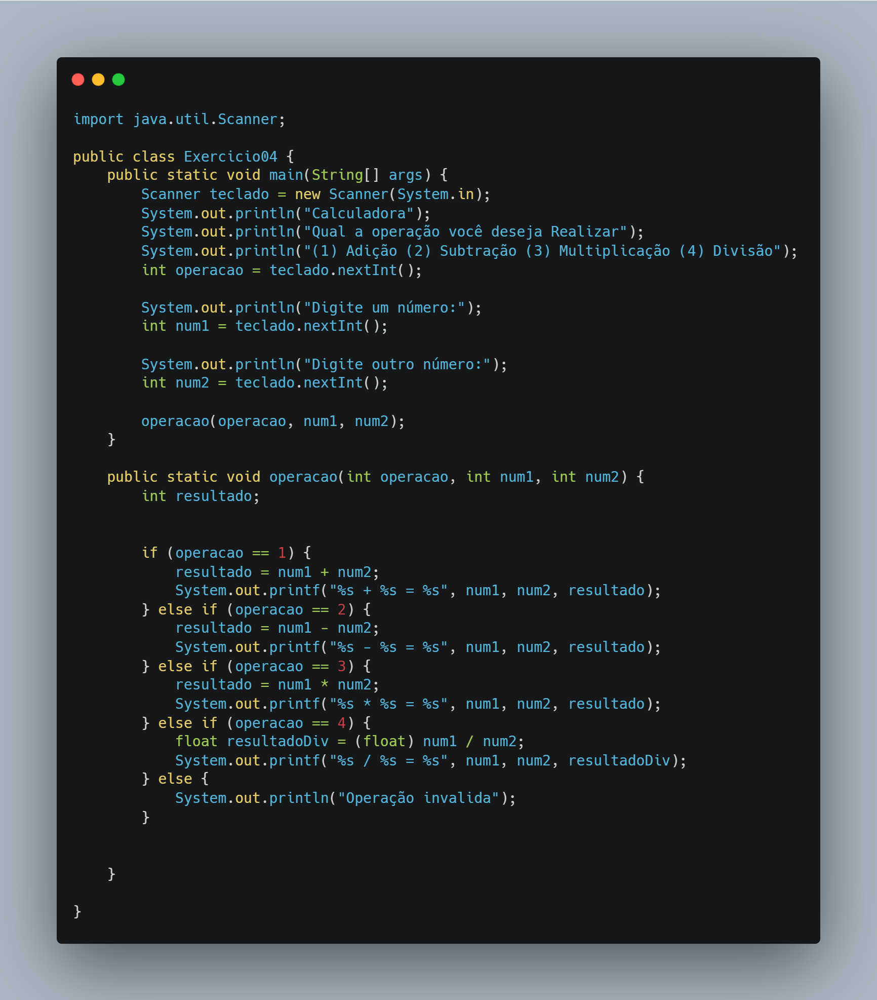

# 🧩 Exercício 04 – Calculadora Simples

> Calculadora de dois números inteiros, com escolha de operação via menu numérico e execução por método externo.

---

## 🎯 Objetivo

Praticar estrutura condicional `if/else` e modularização com métodos, criando uma calculadora que realiza:
- Adição
- Subtração
- Multiplicação
- Divisão

---

## 📘 Conceitos aplicados

- Entrada de dados com `Scanner`
- Estrutura condicional `if / else if`
- Tipagem com `int` e `float`
- Criação e chamada de método com parâmetros

---

## 🔎 Código (resumo)

```java
System.out.println("(1) Adição (2) Subtração (3) Multiplicação (4) Divisão");
int operacao = teclado.nextInt();
operacao(operacao, num1, num2);
```

```java
public static void operacao(int operacao, int num1, int num2) {
    if (operacao == 1) {
        System.out.printf("%s + %s = %s", num1, num2, num1 + num2);
    } else if (...) {
        ...
    }
}
```



---

## 🔧 Possíveis melhorias

- Trocar `if/else` por `switch-case` para maior clareza
- Validar divisão por zero antes de executar
- Permitir que o usuário realize múltiplas operações em um loop
- Exibir o nome da operação junto do resultado
