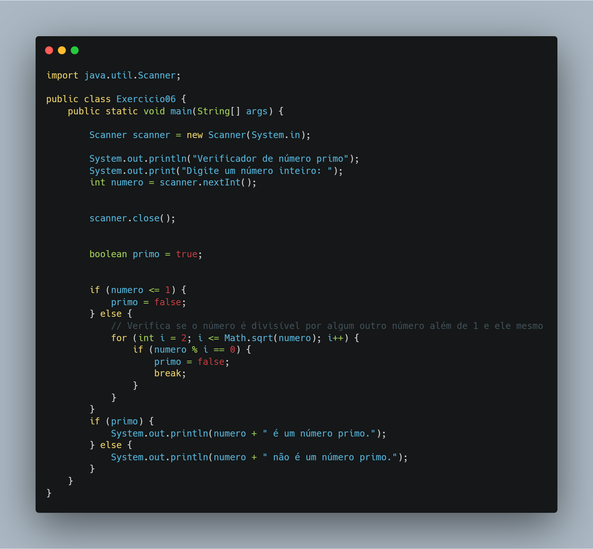

# 🧩 Exercício 06 – Verificação de Número Primo

> Verifica se um número informado pelo usuário é primo utilizando lógica otimizada com `Math.sqrt()` e flag booleana.

---

## 🎯 Objetivo

Desenvolver um verificador de número primo com otimização de performance usando:
- Redução do intervalo de verificação (`Math.sqrt`)
- Uso de flag booleana e controle de repetição

---

## 📘 Conceitos aplicados

- Entrada de dados com `Scanner`
- Estrutura de repetição `for`
- Validação matemática com `%`
- Otimização com `Math.sqrt()`
- Controle de fluxo com `boolean` e `break`

---

## 🔎 Código (resumo)

```java
boolean primo = true;
for (int i = 2; i <= Math.sqrt(numero); i++) {
    if (numero % i == 0) {
        primo = false;
        break;
    }
}
```



---

## 🔧 Possíveis melhorias

- Permitir verificação de múltiplos números em sequência
- Exibir os divisores quando o número **não** for primo
- Implementar em forma de método reutilizável (`isPrimo(int n)`)
