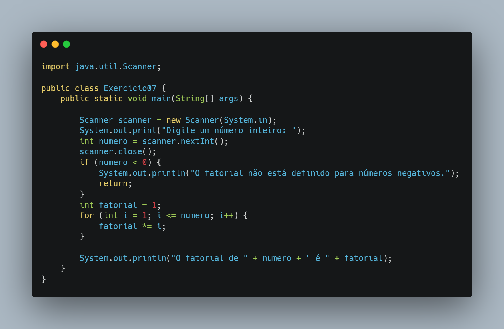

# 🧩 Exercício 07 – Cálculo de Fatorial

> Calcula o fatorial de um número inteiro informado pelo usuário, com verificação de entrada negativa.

---

## 🎯 Objetivo

Aplicar repetição com `for` para multiplicação acumulada e validar entrada para evitar casos matematicamente inválidos (fatorial de número negativo).

---

## 📘 Conceitos aplicados

- Entrada de dados com `Scanner`
- Estrutura de repetição `for`
- Multiplicação acumulada
- Validação de número negativo
- Impressão formatada com concatenação

---

## 🔎 Código (resumo)

```java
if (numero < 0) {
    System.out.println("O fatorial não está definido para números negativos.");
    return;
}
int fatorial = 1;
for (int i = 1; i <= numero; i++) {
    fatorial *= i;
}
```



---

## 🔧 Possíveis melhorias

- Permitir entrada de múltiplos números em sequência
- Separar a lógica de cálculo em um método (`int calcularFatorial(int n)`)
- Usar `BigInteger` para lidar com fatoriais muito grandes
