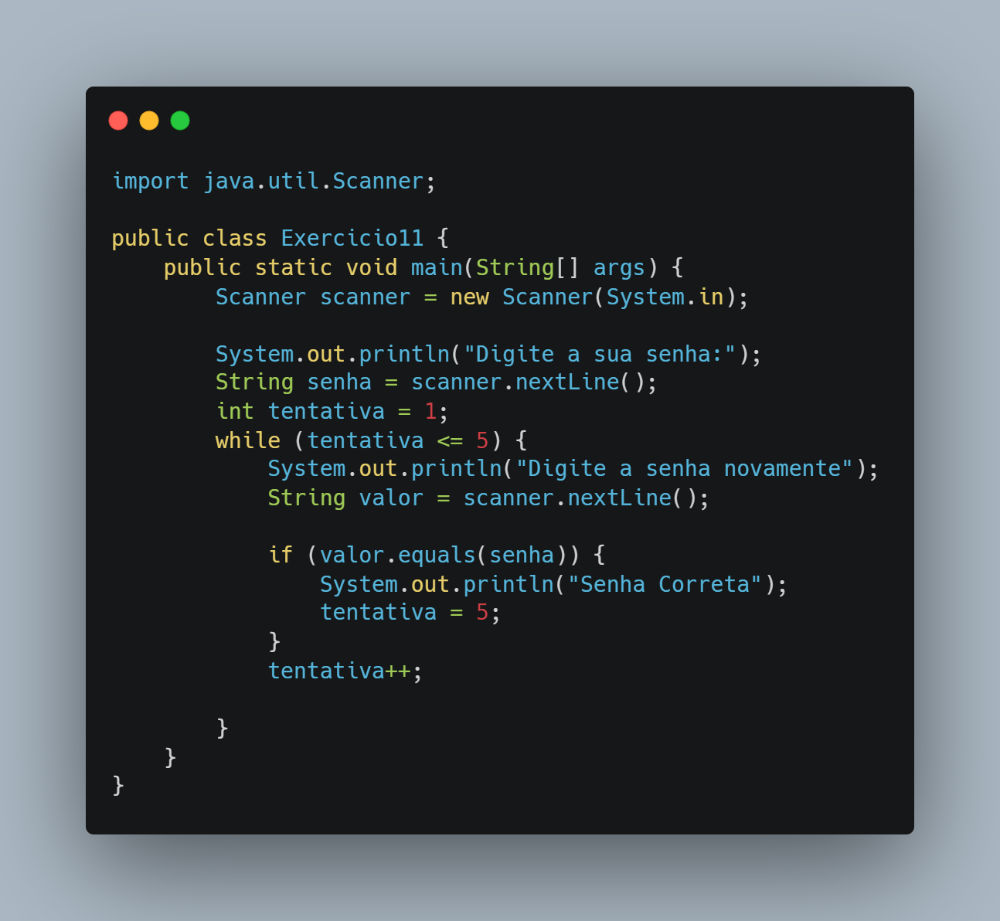

# 🧩 Exercício 11 – Verificação de Senha com Tentativas

> Solicita a senha correta no início e permite até 5 tentativas para o usuário acertar, usando `while`.

---

## 🎯 Objetivo

Simular um sistema de verificação com tentativa limitada, onde a senha é definida previamente e o usuário tem até 5 chances para acertar.

---

## 📘 Conceitos aplicados

- Entrada de texto com `Scanner`
- Laço de repetição `while`
- Comparação de `String`
- Controle de tentativas com variável contador
- Fluxo de saída antecipado (`if` → encerra tentativas)

---

## 🔎 Código (resumo)

```java
System.out.println("Digite a sua senha:");
String senha = scanner.nextLine();

int tentativa = 1;
while (tentativa <= 5) {
    System.out.println("Digite a senha novamente");
    String valor = scanner.nextLine();

    if (valor.equals(senha)) {
        System.out.println("Senha Correta");
        tentativa = 5;
    }
    tentativa++;
}
```



---

## 🔧 Possíveis melhorias

- Informar quantas tentativas ainda restam
- Bloquear acesso após 5 falhas com mensagem clara
- Encerrar o programa com `break` assim que a senha for validada
- Separar a lógica de validação em um método
