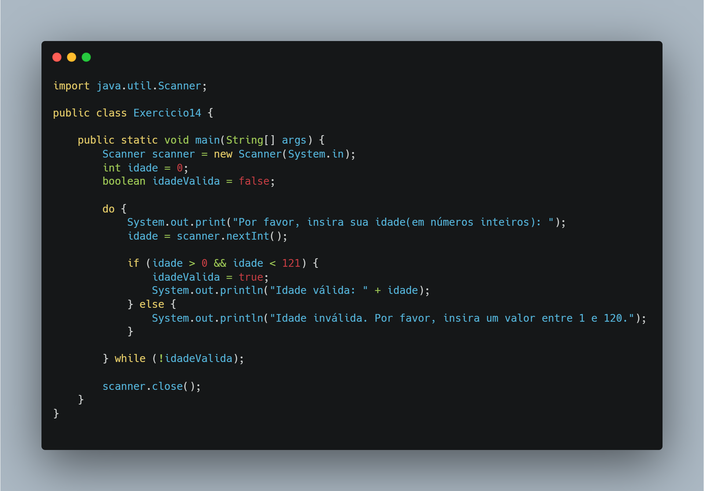

# 🧩 Exercício 14 – Validação de Idade

> Solicita uma idade válida (entre 1 e 120) usando `do-while`.

---

## 🎯 Objetivo

Forçar a entrada correta por meio de repetição com validação de intervalo.

---

## 📘 Conceitos aplicados

- Estrutura `do-while`
- Validação de faixa numérica
- Uso de `Scanner`

---

## 🔎 Código (resumo)

```java
do {
    System.out.println("Digite sua idade:");
    idade = scanner.nextInt();
} while (idade <= 0 || idade > 120);
```



---

## 🔧 Possíveis melhorias

- Exibir mensagem de erro personalizada ao digitar valor inválido
