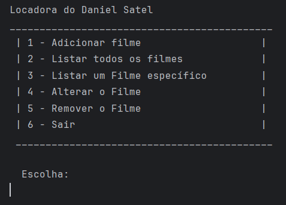
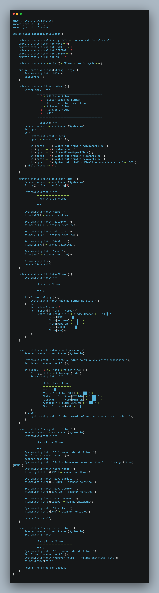

# 🧩 Trabalho do 2º Bimestre – Sistema de Locadora

> Projeto final do 2º bimestre: um sistema de gerenciamento de filmes, com operações completas de cadastro, listagem, busca, alteração e remoção.

---

## 🎯 Objetivo

Aplicar todos os conhecimentos do bimestre em um sistema completo com:
- Estrutura de menu interativo
- Organização de dados com arrays dentro de `ArrayList`
- Separação da lógica em métodos claros
- Manipulação de entradas do usuário com validação

---

## 🧠 Funcionalidades implementadas

- Cadastro de filmes (nome, estúdio, diretor, gênero, ano)
- Listagem completa com índice e campos formatados
- Consulta de filme específico por índice
- Alteração dos dados de um filme
- Remoção de um filme da lista
- Menu iterativo com opção de saída

---

## 💻 Menu do sistema



---

## 🔎 Estrutura de código

```java
String[] filme = new String[5]; // Nome, Estúdio, Diretor, Gênero, Ano
filmes.add(filme);
System.out.println(filme[NOME] + " - " + filme[ANO]);
```



---

## 📂 Estrutura do projeto

```
trabalhos/
└── trabalho-2bim/
    └── LocadoraDanielSatel.java
```

---

## 🚀 O que aprendi

- Como aplicar `ArrayList<String[]>` para representar entidades
- Controle de menu com `do-while` e `if`
- Validação de entrada com índice
- Organização modular de métodos
- Simulação de CRUD sem banco de dados

---

## 🔧 Melhorias futuras

- Substituir `String[]` por uma classe `Filme` (POO)
- Permitir busca por nome ou gênero
- Armazenar dados em arquivo `.txt` para persistência
- Adicionar opção de ordenar por ano ou nome
